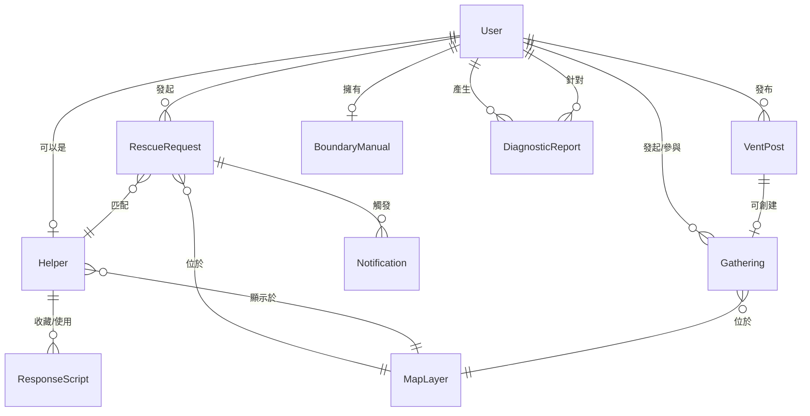

# 🎭 節慶互助平台 - ORCA 分析文檔 v1.1

> **版本說明**：第一代 ORCA 分析，基於 blue-print 的初步對象識別與關係定義，已完成 MVP 階段決策確認  
> **建立日期**：2024  
> **狀態**：MVP 決策已確認 - 可進入下一階段設計  
> **注意**：此關係圖用於理解業務邏輯，實際資料庫設計由後端團隊負責

---

## 📋 目錄

1. [Objects（對象）](#objects對象)
2. [Relationships（關係）](#relationships關係)
3. [Calls to Action（功能操作）](#calls-to-action功能操作)
4. [Attributes（屬性）](#attributes屬性)
5. [待確認問題](#待確認問題)

---

## Objects（對象）

### 核心對象清單

#### 1. User（用戶）
**來源**：5 個用戶角色的基礎實體  
**描述**：系統中所有角色的基礎對象，可切換不同角色身份  
**相關板塊**：所有板塊  
**MVP 限制**：一個 User 只能有一個 Helper 身份

**角色類型**：
- `Escapee` - 焦慮的求助者
- `Helper` - 專業的閒人
- `WokeElder` - 覺醒的長輩
- `SilentBuffer` - 夾心餅乾配偶
- `UrbanLoner` - 節慶邊緣人

---

#### 2. RescueRequest（救援請求）
**來源**：B1 避難中心  
**描述**：用戶發起的即時救援需求，包含人力請求與空間導航  
**相關板塊**：B1, B4, B6, B7

**請求類型**：
- `人力請求` - 需要 Helper 協助
- `空間導航` - 需要避難地點資訊
- `混合` - 同時需要人力與空間

---

#### 3. Helper（救援者）
**來源**：B4 英雄榜  
**描述**：提供救援服務的專業閒人，具備特殊技能  
**相關板塊**：B1, B4, B6

**狀態**：
- `online` - 在線可接案
- `offline` - 離線
- `busy` - 正在執行任務

---

#### 4. ResponseScript（應對腳本）
**來源**：B2 應對錦囊  
**描述**：對話腳本，用於應對長輩問話  
**相關板塊**：B2

**語氣類型**：
- `humorous` - 幽默
- `cold` - 冷漠
- `laid-back` - 擺爛

**實作方式**：
- 腳本由前端工程師或 API SERVER 提供
- 不依賴 AI 生成（MVP 階段）

---

#### 5. DiagnosticReport（診斷報告）
**來源**：B3 角色診斷  
**描述**：雙向心理測驗的結果報告  
**相關板塊**：B3

**測驗類型**：
- `elder` - 長輩端測驗
- `junior` - 後輩端測驗

---

#### 6. VentPost（宣洩貼文）
**來源**：B5 同溫層牆  
**描述**：用戶發布的匿名或公開宣洩內容  
**相關板塊**：B5

**內容類型**：
- 純文字
- 文字 + 圖片
- 現場戰況直播

---

#### 7. Gathering（聚會）
**來源**：B5 同溫層牆 - 即時湊團  
**描述**：邊緣人發起的節慶小聚活動  
**相關板塊**：B5, B6

**狀態**：
- `open` - 開放報名
- `full` - 已額滿
- `completed` - 已完成
- `cancelled` - 已取消

---

#### 8. MapLayer（地圖圖層）
**來源**：B6 戰況地圖  
**描述**：地圖上的各種可視化圖層  
**相關板塊**：B1, B4, B5, B6

**圖層類型**：
- `rescue-point` - 救援點
- `helper` - 閒人位置
- `sanctuary` - 避難空間
- `loner` - 邊緣人座標
- `heat-zone` - 社交高壓區

---

#### 9. Notification（通知）
**來源**：B7 Line 即時通  
**描述**：系統發送的各類通知訊息  
**相關板塊**：B7

**通知類型**：
- `rescue-matched` - 救援匹配成功
- `survival-check` - 生存回報
- `gathering-invite` - 聚會邀請
- `helper-request` - Helper 收到請求

---

#### 10. BoundaryManual（邊界說明書）
**來源**：B8 提問說明書  
**描述**：用戶設定的個人社交邊界清單  
**相關板塊**：B8

**功能**：
- 定義接受/不接受的話題
- 生成分享 URL
- 追蹤訪問統計

---


## Relationships（關係）

### 關係圖



### 關係詳細說明

#### 一對多關係（One-to-Many）

1. **User → RescueRequest**
   - 一個用戶可以發起多個救援請求
   - 關係屬性：`userId`（外鍵）

2. **User → VentPost**
   - 一個用戶可以發布多個宣洩貼文
   - 關係屬性：`userId`（外鍵），`isAnonymous`（可匿名）

3. **User → Gathering**
   - 一個用戶可以發起多個聚會
   - 一個用戶可以參與多個聚會（多對多）
   - 關係屬性：`creatorId`（外鍵），`participants[]`（多對多）

4. **User → DiagnosticReport**
   - 一個用戶可以產生多個診斷報告
   - 關係屬性：`userId`（外鍵）

6. **Helper → ResponseScript**
   - 一個 Helper 可以收藏多個腳本
   - 關係屬性：`savedByUsers[]`（多對多）

#### 一對一關係（One-to-One）

1. **User → Helper**
   - 一個用戶只能有一個 Helper 身份（MVP 階段）
   - 關係屬性：`userId`（外鍵），一對一，唯一關係

2. **User → BoundaryManual**
   - 一個用戶擁有一個邊界說明書
   - 關係屬性：`userId`（外鍵），唯一

#### 多對多關係（Many-to-Many）

1. **RescueRequest ↔ Helper**
   - 一個救援請求匹配一個 Helper（系統自動匹配，一對一）
   - 一個 Helper 可以接受多個救援請求（但同時只能處理一個）
   - 關係屬性：`matchedHelperId`（外鍵）
   - **MVP 決策**：採用一對一自動匹配，降低施工難度

2. **Gathering ↔ User（參與者）**
   - 一個聚會可以有多個參與者
   - 一個用戶可以參與多個聚會
   - 關係屬性：`participants[]`（陣列）

---

## Calls to Action（功能操作）

### User（用戶）操作

| 操作 | 描述 | 觸發條件 | 相關對象 |
|------|------|----------|----------|
| `register` | 註冊帳號 | 新用戶 | User |
| `login` | 登入系統 | 已註冊用戶 | User |
| `updateProfile` | 更新個人資料 | 已登入 | User |
| `switchRole` | 切換角色身份 | 已登入 | User |
| `viewDashboard` | 查看個人儀表板 | 已登入 | User, RescueRequest, Gathering |
| `deleteAccount` | 刪除帳號 | 已登入，需確認 | User |

### RescueRequest（救援請求）操作

| 操作 | 描述 | 觸發條件 | 相關對象 |
|------|------|----------|----------|
| `createRequest` | 建立救援請求 | 已登入，角色為 Escapee/SilentBuffer | RescueRequest |
| `setStressLevel` | 設定壓力等級（1-5） | 建立請求時 | RescueRequest |
| `setBudget` | 設定預算 | 建立請求時 | RescueRequest |
| `viewMatches` | 查看匹配的 Helper | 請求狀態為 pending | RescueRequest, Helper |
| `acceptMatch` | 接受 Helper 匹配 | 有匹配結果 | RescueRequest, Helper |
| `rejectMatch` | 拒絕 Helper 匹配 | 有匹配結果 | RescueRequest |
| `cancelRequest` | 取消請求 | 請求狀態為 pending/matched | RescueRequest |
| `completeRequest` | 標記請求完成 | 請求狀態為 in-progress | RescueRequest |
| `rateHelper` | 評價 Helper | 請求完成後 | RescueRequest, Helper |

### Helper（救援者）操作

| 操作 | 描述 | 觸發條件 | 相關對象 |
|------|------|----------|----------|
| `registerAsHelper` | 註冊成為 Helper | 已登入用戶 | User, Helper |
| `setSkills` | 設定技能標籤 | Helper 身份 | Helper |
| `toggleStatus` | 切換接案狀態 | Helper 身份 | Helper |
| `viewAvailableRequests` | 查看待接案件 | 狀態為 online | Helper, RescueRequest |
| `acceptRequest` | 接受救援請求 | 狀態為 online，有可用請求 | Helper, RescueRequest |
| `rejectRequest` | 拒絕救援請求 | 收到請求通知 | Helper, RescueRequest |
| `viewHistory` | 查看歷史業績 | Helper 身份 | Helper, RescueRequest |
| `updateBio` | 更新個人簡介 | Helper 身份 | Helper |
| `setHourlyRate` | 設定時薪 | Helper 身份 | Helper |

### ResponseScript（應對腳本）操作

| 操作 | 描述 | 觸發條件 | 相關對象 |
|------|------|----------|----------|
| `generateScript` | 生成 AI 腳本 | 已登入 | ResponseScript |
| `selectTone` | 選擇語氣 | 生成腳本時 | ResponseScript |
| `copyScript` | 複製腳本 | 腳本生成後 | ResponseScript |
| `saveScript` | 收藏腳本 | 已登入 | ResponseScript, User |
| `viewSavedScripts` | 查看收藏的腳本 | 已登入 | ResponseScript, User |

### DiagnosticReport（診斷報告）操作

| 操作 | 描述 | 觸發條件 | 相關對象 |
|------|------|----------|----------|
| `startTest` | 開始測驗 | 已登入 | DiagnosticReport |
| `selectTestType` | 選擇測驗類型（長輩/後輩） | 開始測驗時 | DiagnosticReport |
| `submitAnswers` | 提交答案 | 測驗進行中 | DiagnosticReport |
| `viewReport` | 查看診斷報告 | 測驗完成後 | DiagnosticReport |
| `shareReport` | 分享報告 | 報告生成後 | DiagnosticReport |
| `getPrescription` | 領取處方箋 | 報告生成後 | DiagnosticReport |

### VentPost（宣洩貼文）操作

| 操作 | 描述 | 觸發條件 | 相關對象 |
|------|------|----------|----------|
| `createPost` | 發布貼文 | 已登入 | VentPost |
| `uploadImages` | 上傳現場照片 | 發布貼文時 | VentPost |
| `setAnonymous` | 設定匿名發布 | 發布貼文時 | VentPost |
| `likePost` | 按讚貼文 | 已登入 | VentPost |
| `commentPost` | 留言 | 已登入 | VentPost |
| `viewFeed` | 查看同溫層貼文流 | 已登入 | VentPost |

### Gathering（聚會）操作

| 操作 | 描述 | 觸發條件 | 相關對象 |
|------|------|----------|----------|
| `createGathering` | 發起聚會 | 已登入，角色為 UrbanLoner | Gathering |
| `setLocation` | 設定地點 | 發起聚會時 | Gathering, MapLayer |
| `setDateTime` | 設定時間 | 發起聚會時 | Gathering |
| `setMaxParticipants` | 設定人數上限 | 發起聚會時 | Gathering |
| `joinGathering` | 加入聚會 | 已登入，聚會狀態為 open | Gathering, User |
| `leaveGathering` | 退出聚會 | 已參與 | Gathering, User |
| `viewParticipants` | 查看參與者 | 已登入 | Gathering, User |
| `cancelGathering` | 取消聚會 | 發起者身份 | Gathering |

### MapLayer（地圖圖層）操作

| 操作 | 描述 | 觸發條件 | 相關對象 |
|------|------|----------|----------|
| `toggleLayer` | 切換圖層顯示 | 已登入 | MapLayer |
| `viewHeatMap` | 查看熱力分布 | 已登入 | MapLayer |
| `clickMarker` | 點擊地圖標記查看詳情 | 已登入 | MapLayer, 相關對象 |
| `navigateToLocation` | 導航到地點 | 已登入 | MapLayer |
| `filterByType` | 依類型篩選 | 已登入 | MapLayer |

### Notification（通知）操作

| 操作 | 描述 | 觸發條件 | 相關對象 |
|------|------|----------|----------|
| `receiveNotification` | 接收通知 | 系統觸發 | Notification |
| `sendLineMessage` | 發送 Line 訊息 | 通知類型為 Line | Notification |
| `viewNotificationHistory` | 查看通知歷史 | 已登入 | Notification |
| `markAsRead` | 標記為已讀 | 收到通知 | Notification |
| `setNotificationPreferences` | 設定通知偏好 | 已登入 | Notification, User |

### BoundaryManual（邊界說明書）操作

| 操作 | 描述 | 觸發條件 | 相關對象 |
|------|------|----------|----------|
| `createManual` | 建立邊界說明書 | 已登入 | BoundaryManual |
| `selectTopics` | 勾選接受/不接受的話題 | 建立說明書時 | BoundaryManual |
| `generateShareUrl` | 生成分享 URL | 說明書建立後 | BoundaryManual |
| `shareManual` | 分享給親友 | 說明書建立後 | BoundaryManual |
| `viewAccessStats` | 查看訪問統計 | 說明書擁有者 | BoundaryManual |
| `updateManual` | 更新邊界清單 | 說明書擁有者 | BoundaryManual |

---

## Attributes（屬性）

### User（用戶）屬性

```typescript
interface User {
  // 識別資訊
  id: string                    // UUID
  email: string                 // 唯一，用於登入
  passwordHash: string          // 加密密碼（前端不直接處理）
  
  // 個人資訊
  nickname: string              // 顯示名稱
  avatar?: string               // 頭像 URL
  phone?: string                // 手機號碼（用於 Line 通知）
  lineUserId?: string           // Line User ID（用於 B7）
  
  // 角色與狀態
  role: UserRole                // 主要角色
  roles: UserRole[]             // 可切換的角色列表（一個用戶可有多個角色）
  isActive: boolean             // 帳號是否啟用
  
  // 地理位置
  location?: {
    lat: number
    lng: number
    address?: string
  }
  
  // 時間戳記
  createdAt: Date
  updatedAt: Date
  lastLoginAt?: Date
}

type UserRole = 
  | 'Escapee'        // 焦慮的求助者
  | 'Helper'         // 專業的閒人
  | 'WokeElder'      // 覺醒的長輩
  | 'SilentBuffer'   // 夾心餅乾配偶
  | 'UrbanLoner'     // 節慶邊緣人
```

### RescueRequest（救援請求）屬性

```typescript
interface RescueRequest {
  // 識別資訊
  id: string                    // UUID
  userId: string                // 外鍵：User.id
  
  // 請求內容
  requestType: '人力請求' | '空間導航' | '混合'
  stressLevel: number           // 1-5，壓力等級
  budget?: number               // 預算（新台幣）
  description?: string          // 詳細描述
  
  // 地理位置
  location: {
    lat: number
    lng: number
    address?: string
  }
  
  // 匹配資訊
  status: 'pending' | 'matched' | 'in-progress' | 'completed' | 'cancelled'
  matchedHelperId?: string      // 外鍵：Helper.id
  matchedAt?: Date
  
  // 評價
  rating?: number               // 1-5，對 Helper 的評價
  review?: string               // 評價內容
  
  // 時間戳記
  createdAt: Date
  updatedAt: Date
  completedAt?: Date
  cancelledAt?: Date
}
```

### Helper（救援者）屬性

```typescript
interface Helper {
  // 識別資訊
  id: string                    // UUID
  userId: string                // 外鍵：User.id（一對一）
  
  // 服務資訊
  skills: string[]              // 技能標籤，如：['酒量大', '會修電腦', '奧斯卡演技']
  bio: string                   // 個人簡介
  hourlyRate?: number           // 時薪（新台幣）
  
  // 狀態管理
  status: 'online' | 'offline' | 'busy'
  availableUntil?: Date         // 可接案截止時間
  
  // 業績統計
  totalCompleted: number        // 完成案件數
  totalEarnings: number         // 總收入
  rating: number                // 平均評價（1-5）
  ratingCount: number           // 評價數量
  
  // 時間戳記
  createdAt: Date
  updatedAt: Date
}
```

### ResponseScript（應對腳本）屬性

```typescript
interface ResponseScript {
  // 識別資訊
  id: string                    // UUID
  
  // 輸入內容
  inputQuestion: string         // 長輩的問話內容
  
  // 生成內容
  tone: 'humorous' | 'cold' | 'laid-back'
  generatedScript: string       // AI 生成的對話腳本
  bodyLanguageTips: string[]   // 肢體語言建議，如：['眼神堅定', '微笑點頭']
  
  // 使用統計
  savedByUsers: string[]       // 收藏此腳本的用戶 ID 列表
  usageCount: number           // 使用次數
  
  // 時間戳記
  createdAt: Date
  updatedAt: Date
}
```

### DiagnosticReport（診斷報告）屬性

```typescript
interface DiagnosticReport {
  // 識別資訊
  id: string                    // UUID
  userId: string                // 外鍵：User.id
  
  // 測驗資訊
  testType: 'elder' | 'junior'
  answers: Record<string, any>  // 測驗答案（JSON）
  
  // 診斷結果
  shadowArea: number            // 心理陰影面積（0-100）
  socialLabel: string           // 社交標籤，如：'高壓型長輩', '敏感型後輩'
  prescription: string          // 處方箋內容（建議與改善方案）
  
  // 分享設定
  isShared: boolean             // 是否已分享
  shareToken?: string           // 分享 token（用於生成分享 URL）
  // MVP 決策：診斷報告分享採用私密連結（token 機制）
  
  // 時間戳記
  createdAt: Date
  updatedAt: Date
}
```

### VentPost（宣洩貼文）屬性

```typescript
interface VentPost {
  // 識別資訊
  id: string                    // UUID
  userId: string                // 外鍵：User.id（可匿名）
  
  // 內容
  content: string               // 貼文內容
  images?: string[]             // 圖片 URL 列表
  isAnonymous: boolean         // 是否匿名發布
  
  // 地理位置（可選）
  location?: {
    lat: number
    lng: number
    address?: string
  }
  
  // 互動統計
  likes: number                 // 按讚數
  comments: Comment[]          // 留言列表
  commentCount: number         // 留言數
  
  // 關聯聚會（可選）
  relatedGatheringId?: string  // 外鍵：Gathering.id
  
  // 時間戳記
  createdAt: Date
  updatedAt: Date
}

interface Comment {
  id: string
  userId: string
  content: string
  isAnonymous: boolean
  createdAt: Date
}
```

### Gathering（聚會）屬性

```typescript
interface Gathering {
  // 識別資訊
  id: string                    // UUID
  creatorId: string            // 外鍵：User.id
  
  // 聚會資訊
  title: string                // 聚會標題
  description: string          // 聚會描述
  
  // 時間地點
  location: {
    lat: number
    lng: number
    address: string
  }
  scheduledAt: Date            // 預定時間
  
  // 參與者
  maxParticipants: number      // 人數上限
  participants: string[]       // 參與者 User ID 列表
  
  // 狀態
  status: 'open' | 'full' | 'completed' | 'cancelled'
  
  // 時間戳記
  createdAt: Date
  updatedAt: Date
  completedAt?: Date
  cancelledAt?: Date
}
```

### MapLayer（地圖圖層）屬性

```typescript
interface MapLayer {
  // 識別資訊
  id: string                    // UUID
  
  // 圖層類型
  type: 'rescue-point' | 'helper' | 'sanctuary' | 'loner' | 'heat-zone'
  
  // 地理位置
  coordinates: {
    lat: number
    lng: number
  }
  
  // 顯示設定
  visible: boolean              // 是否顯示
  zIndex: number                // 圖層層級
  
  // 關聯數據
  relatedObjectId: string      // 關聯的對象 ID（如 RescueRequest.id, Helper.id）
  relatedObjectType: string    // 關聯的對象類型
  
  // 熱力圖數據（僅 heat-zone 類型）
  heatData?: {
    intensity: number          // 強度（0-100）
    radius: number             // 影響半徑（公尺）
  }
  
  // 時間戳記
  createdAt: Date
  updatedAt: Date
}
```

### Notification（通知）屬性

```typescript
interface Notification {
  // 識別資訊
  id: string                    // UUID
  userId: string                // 外鍵：User.id
  
  // 通知內容
  type: 'rescue-matched' | 'survival-check' | 'gathering-invite' | 'helper-request'
  title: string                 // 通知標題
  content: string               // 通知內容
  
  // Line 整合
  lineMessageId?: string        // Line 訊息 ID
  lineSentAt?: Date             // Line 發送時間
  
  // 狀態
  isRead: boolean               // 是否已讀
  readAt?: Date
  
  // 關聯對象
  relatedObjectId?: string      // 關聯的對象 ID
  relatedObjectType?: string   // 關聯的對象類型
  
  // 時間戳記
  createdAt: Date
  updatedAt: Date
}
```

### BoundaryManual（邊界說明書）屬性

```typescript
interface BoundaryManual {
  // 識別資訊
  id: string                    // UUID
  userId: string                // 外鍵：User.id（一對一，唯一）
  
  // 分享設定
  shareUrl: string              // 分享 URL（如：/boundary/{shareToken}）
  shareToken: string            // 分享 token（用於生成 URL）
  isPublic: boolean             // 是否公開（任何人都可訪問）
  
  // 邊界清單
  acceptedTopics: string[]     // 接受的話題列表
  rejectedTopics: string[]     // 不接受的話題列表
  
  // 訪問統計
  viewCount: number            // 訪問次數
  lastViewedAt?: Date          // 最後訪問時間
  
  // 時間戳記
  createdAt: Date
  updatedAt: Date
}
```

---

## 已確認決策（MVP 階段）

> **決策日期**：2024  
> **決策原則**：優先選擇施工難度較低的方案，符合 MVP 快速迭代需求

### 對象層級決策

1. **User 與 Helper 的關係**
   - ✅ **決策**：一個 User 只能有一個 Helper 身份（MVP 階段）
   - **理由**：簡化資料模型，降低開發複雜度
   - **實作**：User 與 Helper 為一對一關係，唯一約束

2. **RescueRequest 的匹配邏輯**
   - ✅ **決策**：一對一自動匹配（系統自動匹配，用戶無法選擇）
   - **理由**：施工難度較低，無需選擇介面與候選列表管理
   - **實作**：系統根據地理位置、技能、狀態自動匹配單一 Helper

3. **Gathering 與 VentPost 的關係**
   - ✅ **決策**：VentPost 可以獨立存在，也可以選擇關聯到 Gathering
   - **理由**：提供彈性，滿足不同使用場景
   - **實作**：`relatedGatheringId` 為可選欄位

### 關係層級決策

4. **MapLayer 的數據來源**
   - ✅ **決策**：MapLayer 是視圖層，數據來源於其他對象（RescueRequest, Helper, Gathering）
   - **理由**：避免資料重複，保持資料一致性
   - **實作**：MapLayer 透過 `relatedObjectId` 與 `relatedObjectType` 關聯到實際對象

5. **Notification 的觸發機制**
   - ✅ **決策**：建立 NotificationRule 對象來管理觸發規則
   - **理由**：可擴展性高，便於後續調整通知邏輯
   - **實作**：由後端團隊實作 NotificationRule 機制

### 功能層級決策

6. **ResponseScript 的實作方式**
   - ✅ **決策**：腳本由前端工程師或 API SERVER 提供（不依賴 AI 生成）
   - **理由**：MVP 階段降低技術複雜度，避免 AI 服務整合成本
   - **實作**：腳本內容預先定義，根據輸入問題與語氣返回對應腳本

7. **診斷報告的分享機制**
   - ✅ **決策**：MVP 階段採用私密連結（token 機制）
   - **理由**：保護用戶隱私，降低權限管理複雜度
   - **實作**：使用 `shareToken` 生成私密連結，可設定過期時間

### 屬性層級決策

8. **地理位置的精確度**
   - ✅ **決策**：RescueRequest 需要精確座標，MapLayer 可以模糊化
   - **理由**：救援請求需要精確位置進行匹配，地圖顯示可接受模糊化以保護隱私
   - **實作**：RescueRequest.location 使用精確座標，MapLayer 可進行座標模糊化處理

9. **匿名機制的實作**
   - ✅ **決策**：保存 userId 用於後台管理，但對外顯示為匿名
   - **理由**：平衡用戶隱私與系統管理需求
   - **實作**：VentPost.userId 必須保存，但 `isAnonymous` 為 true 時對外不顯示用戶資訊

10. **Line 整合的範圍**
    - ✅ **決策**：用戶可設定通知偏好，選擇哪些類型要發送到 Line
    - **理由**：提供用戶控制權，避免通知過載
    - **實作**：User 設定通知偏好，系統根據偏好決定是否發送 Line 通知

### BFF 聚合決策

11. **數據載入策略**
    - ✅ **決策**：
      - 救援請求詳情頁：需要 RescueRequest + Helper 資訊 + 地圖位置（聚合）
      - 個人儀表板：可以分開載入（RescueRequest 列表、Gathering 列表、Notification 列表）
      - 地圖頁面：可以分開載入不同圖層（救援點、閒人、避難空間）
    - **理由**：平衡載入速度與資料完整性，支援獨立 Skeleton 載入
    - **實作**：參考 `docs/bff-paths.md` 中的頁面複雜度分析

12. **頁面複雜度判斷**
    - ✅ **決策**：
      - **Simple（1:1）**：邊界說明書頁面、應對錦囊頁面
      - **Standard（1:2-3）**：救援請求詳情頁（請求 + Helper + 地圖）
      - **Complex（1:N）**：個人儀表板（多個獨立區塊）、戰況地圖（多個圖層）
    - **理由**：根據 UI 邏輯區塊決定 BFF 路徑數量，避免過度聚合
    - **實作**：參考 `docs/bff-paths.md` 中的 BFF 路徑設計

---

## 下一步行動

### 第一代迭代建議

1. **驗證對象完整性**
   - [ ] 與團隊討論是否遺漏重要對象
   - [ ] 確認對象命名是否符合業務邏輯

2. **細化關係定義**
   - [ ] 繪製完整的 ERD 圖
   - [ ] 確認外鍵與約束條件（與後端團隊對齊）

3. **優先級排序**
   - [ ] 標記 MVP 功能
   - [ ] 決定第一階段開發範圍

4. **BFF 設計準備**
   - [ ] 將 Calls to Action 對應到 BFF 路徑設計
   - [ ] 將 Attributes 對應到 BFF 回應格式
   - [ ] 與後端團隊確認聚合邏輯

---

**文檔版本**：v1.1（已確認 MVP 決策）  
**最後更新**：2024  
**維護者**：待指定

