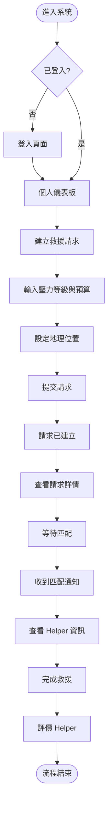

# 產品需求文件 (PRD) v1.0

> **版本**：v1.0  
> **建立日期**：2025  
> **目標讀者**：UIUX 設計師、產品管理師、前端/後端工程師  
> **文檔目的**：定義產品需求、設計規格與技術實作細節，平衡呈現設計與工程視角

---

## 目錄

1. [文檔概述](#文檔概述)
2. [背景簡介（產品目標）](#背景簡介產品目標)
3. [功能清單（Feature List）](#功能清單feature-list)
4. [功能分解圖（Functional Decomposition Diagram）](#功能分解圖functional-decomposition-diagram)
5. [功能流程圖（User Flows）](#功能流程圖user-flows)
6. [Site Map 與資訊架構（Site Map & Information Architecture）](#site-map-與資訊架構site-map--information-architecture)
7. [Wireframe 與 UI 規格（設計規格）](#wireframe-與-ui-規格設計規格)
8. [技術規格（工程規格）](#技術規格工程規格)
9. [MVP 決策記錄](#mvp-決策記錄)
10. [驗收標準（Acceptance Criteria）](#驗收標準acceptance-criteria)
11. [修訂追蹤表（Revision History）](#修訂追蹤表revision-history)

---

## 文檔概述

### 版本資訊
- **版本**：v1.0
- **建立日期**：2025
- **最後更新**：2025
- **維護者**：待指定

### 目標讀者
- **UIUX 設計師**：關注頁面布局、UI 區塊、互動流程、設計規範
- **產品管理師**：關注功能需求、用戶流程、優先級、驗收標準
- **前端/後端工程師**：關注技術規格、資料結構、API 設計、實作細節

### 文檔目的
本 PRD 旨在：
- 定義產品功能需求與業務邏輯
- 提供清晰的設計規格與 UI/UX 指引
- 提供完整的技術規格與實作細節
- 建立設計師與工程師的對齊基準
- 定義驗收標準與檢查清單

---

## 背景簡介（產品目標）

### 產品名稱
**節慶互助平台 - ORCA**

### 產品定位
協助用戶應對節慶期間的社交壓力，提供救援服務、應對工具、社群連結與自我診斷功能。

### 目標用戶
系統支援 5 種用戶角色，每種角色有不同的使用場景與需求：

| 用戶角色 | 英文名稱 | 主要需求 | 核心功能 |
|---------|---------|---------|---------|
| 焦慮的求助者 | Escapee | 需要即時救援與應對工具 | 建立救援請求、應對錦囊、角色診斷 |
| 專業的閒人 | Helper | 提供救援服務 | Helper 註冊、接案管理、業績統計 |
| 覺醒的長輩 | WokeElder | 了解溝通邊界 | 角色診斷（長輩端）、邊界說明書 |
| 夾心餅乾配偶 | SilentBuffer | 需要救援與應對工具 | 建立救援請求、應對錦囊、同溫層牆 |
| 節慶自由人 | UrbanLoner | 尋找同溫層與聚會 | 發起/參與聚會、同溫層牆 |

### 核心價值
1. **即時救援**：快速匹配 Helper，提供人力支援或空間導航
2. **應對工具**：生成應對腳本，協助用戶應對長輩問話
3. **社群連結**：同溫層牆與聚會功能，尋找志同道合的夥伴
4. **自我診斷**：角色診斷工具，了解自己的社交模式與心理陰影面積

### 業務目標
- **MVP 階段**：驗證核心救援功能與 Helper 匹配機制
- **Phase 2**：擴展社群功能與診斷工具
- **長期目標**：建立節慶期間的互助生態系統

---

## 功能清單（Feature List）

### MVP 核心功能（優先級 P0）

#### 1. 認證系統
- **登入**：Email + 密碼登入，支援記住我
- **註冊**：Email + 密碼 + 暱稱註冊
- **功能描述**：用戶身份認證與基本資料管理

#### 2. 救援功能（B1 避難中心）
- **建立救援請求**：選擇請求類型、設定壓力等級、輸入預算與描述、選擇地理位置
- **救援請求詳情**：查看請求狀態、匹配的 Helper 資訊、地圖位置
- **功能描述**：用戶發起救援需求，系統自動匹配 Helper

#### 3. Helper 功能（B4 英雄榜）
- **註冊成為 Helper**：填寫個人簡介、選擇技能標籤、設定時薪
- **Helper 個人檔案**：顯示 Helper 資訊、業績統計、評價列表
- **Helper 儀表板**：查看可接案件、進行中案件、歷史案件、業績統計
- **功能描述**：Helper 註冊、接案管理、業績追蹤

#### 4. 個人儀表板
- **用戶資訊卡片**：顯示頭像、名稱、角色
- **快速操作**：建立請求、發起聚會、應對錦囊
- **我的救援請求**：顯示用戶的救援請求列表
- **我參與的聚會**：顯示用戶參與的聚會列表
- **通知中心**：顯示未讀通知數量與列表
- **功能描述**：用戶主頁，整合所有個人相關資訊

#### 5. 通知系統（B7 Line 即時通）
- **通知列表**：支援全部/未讀/已讀篩選
- **通知類型**：救援匹配、生存檢查、聚會邀請、Helper 請求
- **功能描述**：系統通知管理，支援多種通知類型

---

### 次要功能（優先級 P1）

#### 6. 應對錦囊（B2）
- **生成腳本**：輸入長輩問話、生成應對腳本
- **腳本顯示**：顯示生成的腳本內容與肢體語言建議
- **收藏功能**：收藏常用腳本
- **功能描述**：協助用戶應對長輩問話的工具

#### 7. 同溫層牆（B5）
- **貼文流**：顯示匿名或公開的宣洩貼文，支援按讚與留言
- **發起聚會**：設定聚會標題、描述、時間、地點、人數上限
- **聚會詳情**：顯示聚會資訊、參與者列表、地圖位置
- **功能描述**：社群互動與聚會管理功能

---

### Phase 2 功能（優先級 P2）

#### 8. 角色診斷（B3）
- **開始測驗**：選擇測驗類型（長輩端/晚輩端）
- **提交答案**：回答測驗問題
- **診斷報告**：顯示心理陰影面積、社交標籤、處方箋
- **功能描述**：雙向心理測驗，了解用戶的社交模式

#### 9. 實況地圖（B6）
- **地圖視覺化**：顯示救援點、Helper 位置、避難空間、自由人座標、熱力分布
- **圖層切換**：支援多種圖層的開關
- **功能描述**：全景視覺化中心，展示整體狀況

#### 10. 邊界說明書（B8）
- **編輯邊界**：設定接受/不接受的話題列表
- **分享功能**：生成分享連結，分享給親友
- **功能描述**：個人社交邊界管理與分享

---

## 功能分解圖（Functional Decomposition Diagram）

### FDD 說明

功能分解圖（Functional Decomposition Diagram, FDD）是一種將系統功能從高層到低層逐步分解的層次化圖表，用於：
- **理解系統架構**：清晰展示系統的功能模組與層次關係
- **規劃開發範圍**：識別功能模組的優先級與開發順序
- **溝通對齊**：幫助設計師與工程師理解功能結構與依賴關係

**閱讀方式**：
- **Level 0**：系統整體
- **Level 1**：主要功能模組（10 個核心功能區塊）
- **Level 2**：子功能（每個模組下的具體功能）
- **Level 3**：具體操作步驟（僅關鍵功能展開）

### 完整功能分解圖

```mermaid
flowchart TD
    System[節慶互助平台系統] --> Auth[認證系統]
    System --> Rescue[救援功能 B1]
    System --> Helper[Helper 功能 B4]
    System --> Dashboard[個人儀表板]
    System --> Notification[通知系統 B7]
    System --> ResponseKit[應對錦囊 B2]
    System --> Venting[同溫層牆 B5]
    System --> Diagnostic[角色診斷 B3]
    System --> LiveMap[實況地圖 B6]
    System --> Boundary[邊界說明書 B8]
    
    Auth --> Login[登入]
    Auth --> Register[註冊]
    Auth --> Profile[個人資料管理]
    
    Rescue --> CreateRequest[建立救援請求]
    Rescue --> ViewRequest[查看救援請求詳情]
    Rescue --> ManageRequest[救援請求管理]
    CreateRequest --> SelectType[選擇請求類型]
    CreateRequest --> SetStressLevel[設定壓力等級]
    CreateRequest --> SetBudget[輸入預算與描述]
    CreateRequest --> SetLocation[選擇地理位置]
    ViewRequest --> ViewStatus[查看請求狀態]
    ViewRequest --> ViewHelper[查看匹配 Helper]
    ViewRequest --> ViewMap[查看地圖位置]
    
    Helper --> RegisterHelper[Helper 註冊]
    Helper --> HelperProfile[Helper 檔案管理]
    Helper --> HelperDashboard[Helper 儀表板]
    Helper --> CaseManagement[接案管理]
    RegisterHelper --> InputBio[填寫個人簡介]
    RegisterHelper --> SelectSkills[選擇技能標籤]
    RegisterHelper --> SetRate[設定時薪]
    HelperDashboard --> ViewAvailable[查看可接案件]
    HelperDashboard --> ViewInProgress[查看進行中案件]
    HelperDashboard --> ViewHistory[查看歷史案件]
    HelperDashboard --> ViewStats[查看業績統計]
    
    Dashboard --> UserInfo[用戶資訊顯示]
    Dashboard --> QuickActions[快速操作]
    Dashboard --> DataIntegration[個人資料整合]
    QuickActions --> CreateRequestLink[建立請求]
    QuickActions --> CreateGatheringLink[發起聚會]
    QuickActions --> ResponseKitLink[應對錦囊]
    DataIntegration --> RescueRequests[救援請求列表]
    DataIntegration --> Gatherings[聚會列表]
    DataIntegration --> Notifications[通知列表]
    
    Notification --> ViewList[通知列表]
    Notification --> FilterNotifications[通知篩選]
    Notification --> ManageStatus[通知狀態管理]
    FilterNotifications --> FilterAll[全部]
    FilterNotifications --> FilterUnread[未讀]
    FilterNotifications --> FilterRead[已讀]
    
    ResponseKit --> GenerateScript[腳本生成]
    ResponseKit --> DisplayScript[腳本顯示]
    ResponseKit --> SaveScript[腳本收藏]
    GenerateScript --> InputQuestion[輸入長輩問話]
    GenerateScript --> Generate[生成腳本]
    DisplayScript --> ViewContent[查看腳本內容]
    DisplayScript --> ViewBodyLanguage[查看肢體語言建議]
    
    Venting --> PostFlow[貼文流]
    Venting --> CreateGathering[發起聚會]
    Venting --> ManageGathering[聚會管理]
    PostFlow --> ViewPosts[顯示貼文]
    PostFlow --> CreatePost[發布貼文]
    PostFlow --> InteractPost[按讚與留言]
    CreateGathering --> SetGatheringInfo[設定聚會資訊]
    CreateGathering --> SetGatheringTime[設定時間地點]
    CreateGathering --> SetMaxParticipants[設定人數上限]
    ManageGathering --> ViewGatheringDetails[查看聚會詳情]
    ManageGathering --> ViewParticipants[查看參與者]
    ManageGathering --> ViewGatheringMap[查看地圖位置]
    
    Diagnostic --> StartTest[開始測驗]
    Diagnostic --> SubmitAnswers[提交答案]
    Diagnostic --> ViewReport[診斷報告]
    StartTest --> SelectTestType[選擇測驗類型]
    ViewReport --> ViewShadowArea[查看心理陰影面積]
    ViewReport --> ViewSocialLabel[查看社交標籤]
    ViewReport --> ViewPrescription[查看處方箋]
    
    LiveMap --> MapVisualization[地圖視覺化]
    LiveMap --> ToggleLayers[圖層切換]
    LiveMap --> MapMarkers[地圖標記]
    MapVisualization --> ViewRescuePoints[顯示救援點]
    MapVisualization --> ViewHelperLocations[顯示 Helper 位置]
    MapVisualization --> ViewSanctuaries[顯示避難空間]
    MapVisualization --> ViewLonerCoords[顯示自由人座標]
    MapVisualization --> ViewHeatMap[顯示熱力分布]
    
    Boundary --> EditBoundary[編輯邊界]
    Boundary --> ShareBoundary[分享功能]
    EditBoundary --> SetAcceptedTopics[設定接受話題]
    EditBoundary --> SetRejectedTopics[設定不接受話題]
    ShareBoundary --> GenerateShareLink[生成分享連結]
    ShareBoundary --> ShareToContacts[分享給親友]
    
    style System fill:#e1f5ff
    style Auth fill:#fff4e1
    style Rescue fill:#ffe1e1
    style Helper fill:#e1ffe1
    style Dashboard fill:#f0e1ff
    style Notification fill:#ffe1f0
    style ResponseKit fill:#e1ffff
    style Venting fill:#ffffe1
    style Diagnostic fill:#e1e1ff
    style LiveMap fill:#ffe1ff
    style Boundary fill:#e1ffe1
```



### 功能模組對照表

| 功能模組 | 英文代碼 | 優先級 | 相關板塊 | 狀態 | 主要子功能 |
|---------|---------|--------|---------|------|-----------|
| **認證系統** | Authentication | P0 | - | MVP | 登入、註冊、個人資料管理 |
| **救援功能** | Rescue | P0 | B1 | MVP | 建立請求、查看詳情、請求管理 |
| **Helper 功能** | Helper | P0 | B4 | MVP | Helper 註冊、檔案管理、儀表板、接案管理 |
| **個人儀表板** | Dashboard | P0 | - | MVP | 用戶資訊、快速操作、資料整合 |
| **通知系統** | Notification | P0 | B7 | MVP | 通知列表、篩選、狀態管理 |
| **應對錦囊** | Response Kit | P1 | B2 | MVP | 腳本生成、顯示、收藏 |
| **同溫層牆** | Venting | P1 | B5 | MVP | 貼文流、發起聚會、聚會管理 |
| **角色診斷** | Diagnostic | P2 | B3 | Phase 2 | 開始測驗、提交答案、診斷報告 |
| **實況地圖** | Live Map | P2 | B6 | Phase 2 | 地圖視覺化、圖層切換、地圖標記 |
| **邊界說明書** | Boundary Manual | P2 | B8 | Phase 2 | 編輯邊界、分享功能 |

### 功能層次說明

#### Level 1：主要功能模組
系統的核心功能區塊，每個模組代表一個獨立的業務領域。

#### Level 2：子功能
每個功能模組下的具體功能點，對應到用戶可執行的操作。

#### Level 3：具體操作步驟
關鍵功能的詳細操作流程，僅在需要時展開（如建立救援請求的完整步驟）。

---

## 功能流程圖（User Flows）

> **詳細用戶流程**：完整的用戶流程圖包含所有 6 個用戶角色的詳細流程、BFF 路徑標註、錯誤處理流程等，請參考 [`docs/user-flows.md`](../user-flows.md)

### 流程圖說明

用戶流程圖展示用戶在系統中完成特定任務的完整路徑，包括：
- **頁面導航**：用戶在各頁面間的移動路徑
- **決策點**：用戶需要做出選擇的關鍵節點
- **系統處理**：系統自動執行的操作

以下提供一個代表性的用戶流程範例：

### 範例流程：Escapee 建立救援請求



**關鍵決策點**：
- 登入狀態檢查
- 請求類型選擇（人力請求/空間導航/混合）
- Helper 匹配確認

**頁面路由**：
- `/login` → `/dashboard` → `/rescue-request/create` → `/rescue-request/[requestId]`

### 主要用戶流程對照表

| 用戶角色 | 主要流程 | 頁面路由 | 優先級 |
|---------|---------|---------|--------|
| **Escapee** | 建立救援請求 | `/rescue-request/create` | P0 |
| **Escapee** | 使用應對錦囊 | `/response-kit` | P1 |
| **Helper** | 註冊並接案 | `/helper/register` → `/helper/dashboard` | P0 |
| **Helper** | 查看可接案件 | `/helper/dashboard` | P0 |
| **UrbanLoner** | 發起聚會 | `/gathering/create` | P1 |
| **UrbanLoner** | 參與聚會 | `/gathering/list` | P1 |
| **WokeElder** | 角色診斷 | `/diagnostic` | P2 |
| **SilentBuffer** | 建立請求+腳本 | `/rescue-request/create` + `/response-kit` | P0/P1 |
| **所有角色** | 查看通知 | `/notifications` | P0 |
| **所有角色** | 建立邊界說明書 | `/boundary-manual` | P2 |

> **完整流程詳情**：包含所有角色的詳細流程圖、BFF 路徑標註、錯誤處理流程、決策點說明等，請參考 [`docs/user-flows.md`](../user-flows.md)

---

## Site Map 與資訊架構（Site Map & Information Architecture）

> **詳細資訊架構**：完整的 Site Map（包含路由細節）、導航結構規劃、麵包屑設計等，請參考 [`docs/information-architecture.md`](../information-architecture.md)

### Site Map 摘要

Site Map 展示網站所有頁面的層次結構與組織方式，幫助理解整體頁面架構與功能模組關係。

#### 視覺化 Site Map

```mermaid
graph TD
    Home[首頁] --> Auth[認證系統 MVP]
    Home --> Dashboard[個人儀表板 MVP]
    Home --> Rescue[救援功能 B1 MVP]
    Home --> Helper[Helper 功能 B4 MVP]
    Home --> Notification[通知系統 B7 MVP]
    Home --> ResponseKit[應對錦囊 B2 MVP]
    Home --> Venting[同溫層牆 B5 MVP]
    Home --> Diagnostic[角色診斷 B3 Phase2]
    Home --> LiveMap[實況地圖 B6 Phase2]
    Home --> Boundary[邊界說明書 B8 Phase2]
    
    Auth --> Login[登入]
    Auth --> Register[註冊]
    
    Dashboard --> DashboardPage[個人儀表板]
    Dashboard --> Profile[個人資料]
    Dashboard --> Notifications[通知中心]
    
    Rescue --> CreateRequest[建立救援請求]
    Rescue --> RequestDetail[救援請求詳情]
    Rescue --> RequestMatch[選擇 Helper]
    
    Helper --> HelperRegister[Helper 註冊]
    Helper --> HelperProfile[Helper 檔案]
    Helper --> HelperSettings[Helper 設定]
    Helper --> HelperDashboard[Helper 儀表板]
    
    ResponseKit --> ResponseKitPage[應對錦囊]
    
    Venting --> VentingFeed[貼文流]
    Venting --> CreateGathering[發起聚會]
    Venting --> GatheringList[聚會列表]
    Venting --> GatheringDetail[聚會詳情]
    
    Diagnostic --> DiagnosticStart[開始測驗]
    Diagnostic --> DiagnosticReport[診斷報告]
    
    LiveMap --> MapPage[實況地圖]
    
    Boundary --> BoundaryManual[邊界說明書]
    Boundary --> BoundaryShare[分享頁]
    
    style Home fill:#e1f5ff
    style Auth fill:#fff4e1
    style Rescue fill:#ffe1e1
    style Helper fill:#e1ffe1
    style Dashboard fill:#f0e1ff
    style Notification fill:#ffe1f0
    style ResponseKit fill:#e1ffff
    style Venting fill:#ffffe1
    style Diagnostic fill:#e1e1ff
    style LiveMap fill:#ffe1ff
    style Boundary fill:#e1ffe1
```



#### 頁面列表摘要

| 頁面名稱 | 功能描述 | 優先級 | 狀態 | 所屬功能模組 |
|---------|---------|--------|------|------------|
| **首頁** | 首頁/登陸頁 | P0 | MVP | - |
| **登入** | 用戶身份認證 | P0 | MVP | 認證系統 |
| **註冊** | 用戶註冊 | P0 | MVP | 認證系統 |
| **個人儀表板** | 用戶主頁，整合個人資訊 | P0 | MVP | 個人儀表板 |
| **個人資料** | 個人資料設定 | P0 | MVP | 個人儀表板 |
| **通知中心** | 系統通知管理 | P0 | MVP | 通知系統 |
| **通知設定** | 通知偏好設定 | P0 | MVP | 通知系統 |
| **建立救援請求** | 發起救援需求 | P0 | MVP | 救援功能 |
| **救援請求詳情** | 查看請求狀態與 Helper 資訊 | P0 | MVP | 救援功能 |
| **選擇 Helper** | 選擇匹配的 Helper | P0 | MVP | 救援功能 |
| **Helper 註冊** | 註冊成為 Helper | P0 | MVP | Helper 功能 |
| **Helper 檔案** | Helper 個人檔案與業績 | P0 | MVP | Helper 功能 |
| **Helper 設定** | Helper 狀態與技能管理 | P0 | MVP | Helper 功能 |
| **Helper 儀表板** | Helper 接案管理 | P0 | MVP | Helper 功能 |
| **應對錦囊** | 生成應對腳本 | P1 | MVP | 應對錦囊 |
| **貼文流** | 同溫層牆貼文流 | P1 | MVP | 同溫層牆 |
| **發起聚會** | 發起節慶聚會 | P1 | MVP | 同溫層牆 |
| **聚會列表** | 瀏覽可用聚會 | P1 | MVP | 同溫層牆 |
| **聚會詳情** | 查看聚會資訊與參與者 | P1 | MVP | 同溫層牆 |
| **開始測驗** | 角色診斷測驗 | P2 | Phase 2 | 角色診斷 |
| **診斷報告** | 查看診斷結果 | P2 | Phase 2 | 角色診斷 |
| **實況地圖** | 地圖視覺化中心 | P2 | Phase 2 | 實況地圖 |
| **邊界說明書** | 個人社交邊界管理 | P2 | Phase 2 | 邊界說明書 |
| **邊界分享頁** | 邊界說明書分享頁（公開） | P2 | Phase 2 | 邊界說明書 |

#### 頁面優先級摘要

**MVP 核心頁面（優先級 P0）**：
- 認證系統：登入、註冊
- 個人儀表板：個人儀表板、個人資料
- 通知系統：通知中心
- 救援功能：建立救援請求、救援請求詳情、選擇 Helper
- Helper 功能：Helper 註冊、Helper 檔案、Helper 設定、Helper 儀表板

**MVP 次要頁面（優先級 P1）**：
- 應對錦囊：應對錦囊
- 同溫層牆：貼文流、發起聚會、聚會列表、聚會詳情

**Phase 2 頁面（優先級 P2）**：
- 角色診斷：開始測驗、診斷報告
- 實況地圖：實況地圖
- 邊界說明書：邊界說明書、邊界分享頁

> **路由細節**：頁面的具體路由路徑請參考 [`docs/information-architecture.md`](../information-architecture.md) 中的完整 Site Map 表格，或 [`docs/construction/page-routes.md`](../construction/page-routes.md) 中的路由設計文檔。

---

### 導航結構

```
首頁
├── 登入/註冊
├── 個人儀表板
├── 避難中心 (B1)
│   ├── 建立救援請求
│   └── 救援請求詳情
├── 應對錦囊 (B2)
├── 角色診斷 (B3)
├── 英雄榜 (B4)
│   ├── Helper 註冊
│   ├── Helper 檔案
│   └── Helper 儀表板
├── 同溫層牆 (B5)
│   ├── 貼文流
│   └── 發起聚會
├── 實況地圖 (B6)
├── 通知中心 (B7)
└── 提問說明書 (B8)
```

### 頁面組織架構

> **詳細頁面組織**：包含路由細節的完整頁面組織架構，請參考 [`docs/information-architecture.md`](../information-architecture.md)

#### 第一層：主要功能區塊

1. **首頁與認證**
   - 首頁/登陸頁
   - 登入
   - 註冊

2. **個人中心**
   - 個人儀表板
   - 個人資料設定
   - 通知中心

3. **救援功能區（B1 避難中心）**
   - 建立救援請求
   - 救援請求詳情

4. **防禦工具區（B2 應對錦囊）**
   - 應對錦囊

5. **Helper 服務區（B4 英雄榜）**
   - Helper 註冊
   - Helper 個人檔案
   - Helper 儀表板

6. **社群互動區（B5 同溫層牆）**
   - 同溫層牆（貼文流）
   - 發起聚會
   - 聚會詳情

### 用戶角色導航差異

#### Escapee（焦慮的求助者）
**主要入口**：
- 避難中心（建立救援請求）
- 應對錦囊（生成腳本）
- 角色診斷（測驗心理陰影面積）
- 同溫層牆（宣洩貼文）

#### Helper（專業的閒人）
**主要入口**：
- Helper 儀表板（查看可接案件）
- Helper 設定（管理狀態與技能）
- 實況地圖（查看救援點）

#### UrbanLoner（節慶自由人）
**主要入口**：
- 同溫層牆（發起/參與聚會）
- 聚會列表（尋找聚會）
- 實況地圖（查看自由人座標）

---

## Wireframe 與 UI 規格（設計規格）

> **參考文檔**：詳細 Wireframe 規格請參考 [`docs/wireframes-v2.md`](../wireframes-v2.md)

### 頁面布局類型

#### 1. 表單頁面模板
**適用頁面**：登入、註冊、建立請求、註冊 Helper、發起聚會

**布局結構**：
- Header（導航列/Logo）
- 表單容器（居中，固定寬度）
  - 表單欄位（依功能而定）
  - 提交按鈕
  - 取消/返回連結

**設計要點**：
- 表單欄位需有清晰的標籤與提示
- 提交按鈕需有載入狀態
- 錯誤訊息需明確顯示

---

#### 2. 詳情頁模板
**適用頁面**：救援請求詳情、Helper 詳情、聚會詳情

**布局結構**：
- Header（導航列）
- 左右分欄（50% / 50%）
  - 左側：主要資訊區塊 + 地圖位置
  - 右側：相關資訊區塊（Helper/參與者/統計）
- 操作按鈕（依權限顯示）

**設計要點**：
- 資訊層級清晰，重要資訊優先顯示
- 地圖位置需清晰標示
- 操作按鈕需有明確的視覺層級

---

#### 3. 儀表板模板
**適用頁面**：個人儀表板、Helper 儀表板

**布局結構**：
- Header（導航列）
- 頂部資訊卡片（用戶資訊/狀態切換/統計）
- 多個獨立區塊（並行載入）
  - 每個區塊獨立顯示 Skeleton 載入狀態
  - 支援獨立刷新

**設計要點**：
- 每個區塊需有獨立的載入狀態（Skeleton）
- 區塊間需有清晰的視覺分隔
- 快速操作需易於訪問

---

#### 4. 列表頁模板
**適用頁面**：通知中心、同溫層牆

**布局結構**：
- Header（導航列）
- 篩選/標籤（可選）
- 列表區塊（瀑布流/分頁）
- 側邊欄（可選，如聚會列表）

**設計要點**：
- 列表項需有清晰的視覺層級
- 支援無限滾動或分頁載入
- 篩選功能需易於使用

---

### UI 區塊對照表

| 功能模組 | 主要 UI 區塊 | 功能描述 | 資料來源 |
|---------|------------|---------|---------|
| **認證系統** | 登入表單 | Email、密碼、記住我 | 用戶輸入 |
| | 註冊表單 | Email、密碼、確認密碼、暱稱 | 用戶輸入 |
| **救援功能（B1）** | 請求類型選擇器 | 人力請求/空間導航/混合 | 用戶輸入 |
| | 壓力等級選擇器 | 1-5 等級 | 用戶輸入 |
| | 地理位置選擇器 | 地圖選擇器 + 地址輸入 | 用戶輸入 + 地圖 API |
| | 請求資訊區塊 | 類型、壓力、預算、描述、狀態 | 救援請求資料 |
| | Helper 卡片 | Helper 資訊（僅已匹配時顯示） | Helper 資料 |
| **Helper 功能（B4）** | 技能標籤選擇器 | 多選技能標籤 | 用戶輸入 |
| | Helper 資訊區塊 | 頭像、名稱、簡介、技能、時薪、狀態 | Helper 資料 |
| | 業績統計卡片 | 完成案件、總收入、評價 | Helper 統計資料 |
| | 狀態切換 | 在線/離線切換 | Helper 狀態 |
| | 可接案件列表 | 救援請求列表 | 救援請求資料 |
| **個人儀表板** | 用戶資訊卡片 | 頭像、名稱、角色 | 用戶資料 |
| | 快速操作按鈕組 | 建立請求、發起聚會、應對錦囊 | 靜態內容 |
| | 救援請求列表 | 用戶的救援請求 | 救援請求資料 |
| | 聚會列表 | 用戶參與的聚會 | 聚會資料 |
| | 通知列表 | 用戶的通知 | 通知資料 |
| **應對錦囊（B2）** | 問話輸入框 | 長輩問話 | 用戶輸入 |
| | 腳本顯示區塊 | 生成的腳本內容 | 腳本資料 |
| | 肢體語言建議 | 建議列表 | 腳本資料 |
| **同溫層牆（B5）** | 貼文流列表 | 匿名或公開的宣洩貼文 | 貼文資料 |
| | 聚會卡片 | 聚會資訊 | 聚會資料 |
| | 參與者列表 | 參與者頭像與名稱 | 參與者資料 |

---

### 設計規範

#### 響應式斷點
- **手機版**：< 768px
- **平板版**：768px - 1024px
- **桌面版**：> 1024px

#### 組件使用規範
> **詳細組件庫規劃**：請參考 [`docs/component-library.md`](../component-library.md)

**基礎組件**：
- `Button`：主要操作按鈕
- `Card`：資訊卡片容器
- `Input`：文字輸入框
- `Textarea`：多行文字輸入
- `Select`：下拉選單
- `Badge`：標籤與狀態標示
- `Avatar`：頭像顯示
- `Skeleton`：載入骨架

**業務組件**：
- `RescueRequestCard`：救援請求卡片
- `HelperCard`：Helper 卡片
- `VentPostCard`：貼文卡片
- `GatheringCard`：聚會卡片
- `NotificationItem`：通知項目

#### 視覺層級與資訊架構
- **主要資訊**：使用較大字體與高對比度
- **次要資訊**：使用較小字體與低對比度
- **操作按鈕**：使用明確的視覺層級（主要/次要/危險）
- **狀態標示**：使用顏色與圖示區分狀態

---

## 技術規格（工程規格）

> **設計師友善說明**：本節提供技術實作細節，供工程師參考。設計師可重點關注「資料需求」與「頁面複雜度」部分，了解頁面的資料載入策略與 UX 影響。

### 頁面路由設計

> **詳細路由設計**：請參考 [`docs/page-routes.md`](../page-routes.md)

#### 路由命名規則
- **嚴格使用 `kebab-case`**：所有路由使用小寫字母與連字號
- **層級限制**：不超過 3 層嵌套
- **動態參數**：
  - SEO 敏感內容使用 `[slug]`
  - 私有內容使用 `[id]`

#### 路由守衛規則

**認證守衛**：
- 所有需要認證的路由都應該使用 Nuxt 3 的 middleware
- 未登入用戶導向 `/login`

**角色守衛**：
- `/rescue-request/create`：僅 Escapee 或 SilentBuffer
- `/helper/*`：僅 Helper 角色
- `/gathering/create`：僅 UrbanLoner

**資源擁有者守衛**：
- `/rescue-request/[requestId]`：請求擁有者或匹配的 Helper
- `/diagnostic/report/[reportId]`：報告擁有者

---

### 資料需求與頁面複雜度

> **設計師重點**：頁面複雜度影響載入策略與 UX 設計。Simple 頁面可一次性載入，Complex 頁面需支援獨立 Skeleton 載入。

#### 頁面複雜度分類

| 複雜度 | 說明 | 頁面範例 | 載入策略 | UX 影響 |
|-------|------|---------|---------|---------|
| **Simple (1:1)** | 一個頁面對應一個資料來源 | 登入頁、應對錦囊頁 | 單一請求，簡單載入 | 可顯示統一載入狀態 |
| **Standard (1:2-3)** | 一個頁面對應 2-3 個資料來源 | 救援請求詳情、Helper 詳情 | 單一 BFF 聚合多個資料 | 需等待所有資料載入完成 |
| **Complex (1:N)** | 一個頁面對應多個獨立資料來源 | 個人儀表板、Helper 儀表板 | 多個 BFF 並行載入 | 需支援獨立 Skeleton 載入 |

#### 資料需求對照表

| 頁面路由 | 頁面複雜度 | 主要資料需求 | 資料來源說明 |
|---------|-----------|------------|------------|
| `/login` | Simple | 無（表單輸入） | 提交後獲取用戶資訊與 token |
| `/register` | Simple | 無（表單輸入） | 提交後獲取用戶資訊與 token |
| `/rescue-request/create` | Simple | 無（表單輸入） | 提交後獲取請求 ID 與狀態 |
| `/rescue-request/[requestId]` | Standard | 救援請求資訊、Helper 資訊（如果已匹配）、地圖位置 | 單一資料來源聚合三個資料模組 |
| `/helper/register` | Simple | 無（表單輸入） | 提交後獲取 Helper ID 與狀態 |
| `/helper/[helperId]` | Standard | Helper 資訊、業績統計、評價列表 | 單一資料來源聚合三個資料模組 |
| `/helper/dashboard` | Complex | 狀態與統計、可接案件列表、進行中案件列表、歷史案件列表 | 四個獨立的資料來源 |
| `/dashboard` | Complex | 用戶資訊、救援請求列表、聚會列表、通知列表 | 四個獨立的資料來源 |
| `/notifications` | Simple | 通知列表 | 單一資料來源，支援篩選與分頁 |
| `/response-kit` | Simple | 無（表單輸入） | 提交後獲取腳本內容 |
| `/venting` | Complex | 貼文流列表、相關聚會列表 | 兩個獨立的資料來源 |
| `/gathering/create` | Simple | 無（表單輸入） | 提交後獲取聚會 ID 與狀態 |
| `/gathering/[gatheringId]` | Standard | 聚會資訊、參與者列表、地圖位置 | 單一資料來源聚合三個資料模組 |

> **技術細節**：完整的 BFF 路徑設計與資料結構定義請參考 [`docs/bff-paths.md`](../bff-paths.md) 與 [`docs/data-requirements.md`](../data-requirements.md)

---

### 前端架構

#### Hooks 設計
> **詳細 Hooks 規劃**：請參考 [`docs/frontend-hooks.md`](../frontend-hooks.md)

**命名規範**：`use[PageContext][Resource]()`

**範例**：
- `useRescueRequestDetails(requestId)`：獲取救援請求詳情
- `useHelperList(filters)`：獲取 Helper 列表
- `useDashboardInitData()`：獲取儀表板初始資料

**實作原則**：
- 使用 Nuxt 3 的 `useFetch` 或 `useAsyncData`
- 獨立載入狀態管理（支援 Skeleton）
- 避免 Waterfall 載入（在 BFF 中聚合）

#### 組件庫規劃
> **詳細組件庫規劃**：請參考 [`docs/component-library.md`](../component-library.md)

**組件分類**：
1. **基礎組件**：基於 shadcn-vue 擴充
2. **業務組件**：對應到 ORCA 對象的專屬組件
3. **布局組件**：頁面結構與導航組件
4. **表單組件**：資料輸入與驗證組件

---

## MVP 決策記錄

> **詳細決策記錄**：請參考 [`docs/mvp-decisions.md`](../mvp-decisions.md)

### 關鍵技術決策

#### 對象層級決策
1. **User 與 Helper 一對一關係**：一個 User 只能有一個 Helper 身份（MVP 階段）
2. **RescueRequest 一對一自動匹配**：系統自動匹配，用戶無法選擇 Helper
3. **VentPost 可選關聯 Gathering**：貼文可以獨立存在，也可以關聯到聚會

#### 功能層級決策
4. **ResponseScript 預先定義**：腳本由前端工程師或 API SERVER 提供（不依賴 AI 生成）
5. **診斷報告私密連結分享**：使用 token 機制生成私密連結

#### BFF 聚合決策
6. **數據載入策略**：
   - 救援請求詳情頁：聚合策略（RescueRequest + Helper + 地圖位置）
   - 個人儀表板：獨立載入策略（多個區塊並行載入）
7. **頁面複雜度判斷**：
   - Simple (1:1)：邊界說明書頁面、應對錦囊頁面
   - Standard (1:2-3)：救援請求詳情頁
   - Complex (1:N)：個人儀表板、實況地圖

### 決策原則
> **決策原則**：優先選擇施工難度較低的方案，符合 MVP 快速迭代需求

### 功能範圍限制
- **MVP 階段**：不包含角色診斷（B3）、實況地圖（B6）、邊界說明書（B8）
- **後續擴展**：Phase 2 將實作上述功能

---

## 驗收標準（Acceptance Criteria）

### 功能驗收標準

#### 認證系統
- [ ] 用戶可以成功登入（Email + 密碼）
- [ ] 用戶可以成功註冊（Email + 密碼 + 暱稱）
- [ ] 登入/註冊失敗時顯示明確的錯誤訊息
- [ ] 登入成功後正確導航到儀表板
- [ ] Token 正確儲存（Cookie 或 LocalStorage）

#### 救援功能（B1）
- [ ] 用戶可以成功建立救援請求（所有必填欄位）
- [ ] 請求建立後正確顯示請求詳情頁
- [ ] 請求詳情頁正確顯示請求資訊、Helper 資訊（如果已匹配）、地圖位置
- [ ] 用戶可以取消請求（僅 pending 狀態）
- [ ] Helper 匹配後正確發送通知

#### Helper 功能（B4）
- [ ] 用戶可以成功註冊成為 Helper
- [ ] Helper 儀表板正確顯示可接案件、進行中案件、歷史案件
- [ ] Helper 可以切換狀態（在線/離線）
- [ ] Helper 詳情頁正確顯示 Helper 資訊、業績統計、評價列表
- [ ] Helper 可以接受救援請求

#### 個人儀表板
- [ ] 儀表板正確顯示用戶資訊卡片
- [ ] 快速操作按鈕正確導航到對應頁面
- [ ] 救援請求列表正確顯示用戶的救援請求
- [ ] 聚會列表正確顯示用戶參與的聚會
- [ ] 通知列表正確顯示用戶的通知
- [ ] 每個區塊獨立顯示 Skeleton 載入狀態

#### 通知系統（B7）
- [ ] 通知列表正確顯示所有通知
- [ ] 篩選功能正常運作（全部/未讀/已讀）
- [ ] 點擊通知正確標記為已讀
- [ ] 點擊通知正確導航到相關頁面

---

### 設計驗收標準

#### UI/UX 驗收
- [ ] 所有頁面符合設計規範（布局、間距、字體）
- [ ] 響應式設計正確運作（手機/平板/桌面）
- [ ] 載入狀態正確顯示（Skeleton、Spinner）
- [ ] 錯誤狀態正確顯示（錯誤訊息、空狀態）
- [ ] 互動反饋明確（按鈕點擊、表單提交）

#### 組件使用驗收
- [ ] 所有組件符合組件庫規範
- [ ] 組件狀態正確顯示（hover、active、disabled）
- [ ] 組件無障礙性符合標準（ARIA 標籤、鍵盤導航）

---

### 技術驗收標準

#### BFF 路徑驗收
- [ ] 所有 BFF 路徑符合命名規範
- [ ] 頁面複雜度分類正確（Simple/Standard/Complex）
- [ ] 資料聚合策略正確實作
- [ ] 錯誤處理統一且明確

#### 資料結構驗收
- [ ] 所有資料結構符合 TypeScript 介面定義
- [ ] 資料驗證正確實作（前端與後端）
- [ ] 資料載入策略正確實作（聚合/獨立載入）

#### 前端架構驗收
- [ ] Hooks 命名符合規範
- [ ] 組件結構符合組件庫規劃
- [ ] 路由守衛正確實作
- [ ] 錯誤處理統一且明確

---

## 修訂追蹤表（Revision History）

| 版本 | 日期 | 修改內容 | 修改者 |
|------|------|---------|--------|
| v1.0 | 2025 | 初始版本建立 | 待指定 |

---

## 附錄

### 相關文檔索引

- **ORCA 分析文檔**：[`docs/orca/orca-analysis-v1.md`](../orca/orca-analysis-v1.md)
- **Wireframe 文檔**：[`docs/wireframes-v2.md`](../wireframes-v2.md)
- **資訊架構與 Site Map**：[`docs/information-architecture.md`](../information-architecture.md) - 完整的 Site Map（包含路由細節）、導航結構規劃、麵包屑設計
- **用戶流程**：[`docs/user-flows.md`](../user-flows.md)
- **BFF 路徑設計**：[`docs/bff-paths.md`](../bff-paths.md)
- **資料需求**：[`docs/data-requirements.md`](../data-requirements.md)
- **頁面路由設計**：[`docs/page-routes.md`](../page-routes.md)
- **前端 Hooks**：[`docs/frontend-hooks.md`](../frontend-hooks.md)
- **組件庫規劃**：[`docs/component-library.md`](../component-library.md)
- **MVP 決策記錄**：[`docs/mvp-decisions.md`](../mvp-decisions.md)

---

**文檔版本**：v1.0  
**最後更新**：2025  
**維護者**：待指定

